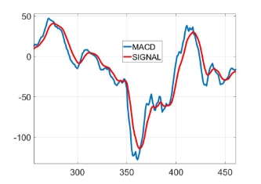

Metody Numeryczne – Zad 1

dr inż. Grzegorz Fotyga, ETI PG

**Wskaźnik giełdowy MACD**

Wskaźnik **MACD** (moving average convergence/divergence, *pol. zbieżność/rozbieżność średniej kroczącej* ) jest to jeden z najpopularniejszych wskaźników analizy technicznej, które wykorzystuje się w analizie giełdowej. Swoją popularność zawdzięcza prostocie implementacji i łatwości interpretacji wyników. Jednak momenty kupna i sprzedaży sygnalizowane przez wskaźnik **MACD** są często sygnałami spóźnionymi i nadają się raczej do inwestycji długoterminowych.

Działanie **MACD** opiera się na tzw. wykładniczej średniej kroczącej (*ang. exponen-    tial moving average, EMA*). Jest to odmiana średniej ważonej, w której znaczenie coraz       bardziej odległych w czasie próbek (wartości, cen akcji) maleje w sposób wykładniczy.      Przymiotnik *krocząca* - wskazuje, że do obliczenia średniej branych jest *N* ostatnich próbek, względem aktualnego (rozpatrywanego) dnia (godziny, ceny otwarcia, ceny za-       mknięcia itp. – w zależności od rodzaju analizy). Liczba próbek branych pod uwagę jest

to tzw. liczba *okresów*, oznaczona przez *N* .

Wykładnicza średnia krocząca dla *N* okresów obliczana jest według następującego wzoru:

*EMAN* = *p*0 +1(1+−(1*α*−)*pα*1)++(1(1−−*αα*)2)2*p*2++··· ··+·+(1(1−−*αα*)*N*)*N pN* (1) gdzie:

- *pi* jest próbką z *i*-tego dnia, *p*0 jest próbką z aktualnego dnia, *pN* - to próbka sprzed *N* dni.

2

- *α* = 

*N* + 1

- *N* - liczba okresów

Wskaźnik **MACD** składa się z 2 wykresów: MACD (nazwa taka sama jak nazwa wskaźnika) i linii sygnału (SIGNAL). Miejsce, w którym MACD przecina SIGNAL od dołu jest sygnałem do zakupu akcji. Miejsce, w którym MACD przecina SIGNAL od góry, jest sygnałem do sprzedaży akcji.

1. Na podstawie wektora próbek (danych wejściowych) należy obliczyć dwie wykład- nicze średnie kroczące (EMA): 26 i 12 okresową,
1. MACD = EMA12 − EMA26
1. Następnie należy wyznaczyć SIGNAL. Jest to wykładnicza średnia krocząca o okresie 9, policzona z MACD.
1. Miejsca przecięcia MACD i SIGNAL wyznaczają najlepsze momenty do kup- na/sprzedaży akcji.

Rysunek 1: Przykład wykresów MACD / SIGNAL

**Zadania do wykonania:**

1. Należy zapoznać się z teorią wskaźnika MACD (z instrukcji oraz źródeł własnych).
1. Dane wejściowe to wektor o długości 1000 w formacie \*.csv. Mogą to być histo- ryczne wartości indeksu WIG20, dane wzięte z giełdy walut FOREX, kryptowaluty, obligacje, surowce itp.
1. Implementacja wskaźnika MACD. Do wyboru są trzy języki: Python, MATLAB, C++. W przypadku python do wczytywania danych w formacie \*.csv można użyć biblioteki pandas. W ramach tego punktu należy opracować i zinterpretować co najmniej dwa wykresy: 1) notowań analizowanego instrumentu finansowego,

   2) MACD+SIGNAL z punktami kupna/sprzedaży. (2 pkt.)
1. Następnie należy ocenić, czy wskaźnik MACD może być pomocny przy podejmowa- niu decyzji o kupnie i sprzedaży analizowanego instrumentu finansowego. W tym celu należny przedstawić i zinterpretować co najmniej dwa wykresy transakcji kupna- sprzedaży. (3 pkt.)
1. Kolejne zadanie polega na zaproponowaniu algorytmu, który w sposób automa- tyczny na podstawie MACD podejmie decyzję o kupnie/sprzedaży akcji. Wynik końcowy to kapitał uzyskany w badanym okresie (uwzględnionym w danych wej- ściowych), biorąc pod uwagę kapitał początkowy: 1000 jednostek analizowanego instrumentu finansowego. (2 pkt).
1. Za wstęp i podsumowanie można otrzymać maksymalnie po 1,5 punktu.

**Sprawozdanie**

W sprawozdaniu należy przedstawić wnioski, uzasadnić przydatność lub brak przydat- ności MACD w analizie technicznej, wskazać miejsca na wykresach, gdzie MACD pomaga lub zawodzi. Należy również dołączyć kod źródłowy w pliku zip. Sprawozdanie w forma- cie pdf oraz plik zip z kodami należy przesłać w odpowiednim miejscu na platformie enauczanie.
